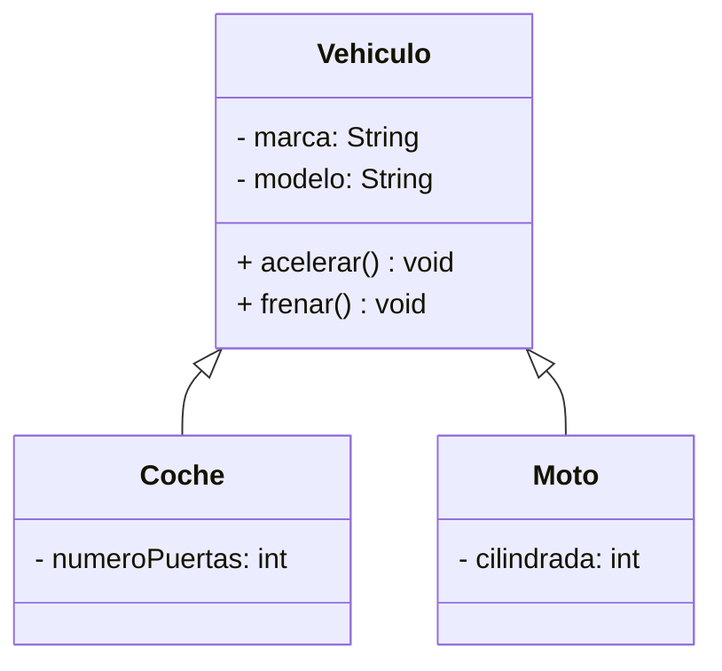

# Título

## Indice

- [Título](#título)
  - [Indice](#indice)
  - [Otro titulo](#otro-titulo)
    - [Nivel 3](#nivel-3)
      - [Nivel 4](#nivel-4)
        - [Nivel 5](#nivel-5)
          - [Nivel 6](#nivel-6)

Esto es un párrafo normal.

Esto es otro parrafo

\# con esto defino un título

## Otro titulo

Este *texto* está en *cursiva* y este **texto** está en **negrita**.

Esto está en ***negrita y cursiva***

### Nivel 3

- **Elemen1**
- *Elem2*

- Primer elemento
- Segundo elemento
  - Subelemento
  - Subelemnto 2
    - Otro subsubelemento
- Tercer elemento

1. Primer elemento numerado
2. Segundo elemento numerado
3. Tercer elemento (De verdad)
4. Tercer elemento (falso)
   1. Subelemento numerado

- [x] Tarea 1
- [ ] Tarea sin acabar
- [x] Tarea 2

> Esto es una cita, un comentario, una aclaracion
> Esto es otra linea de la cita
> > Cita anidada
> Podemos definir **negrita**, o *cursiva*
>
> - Tambien podemos crear listas
> - Ultimo de la lista de la cita


[Markdown Guide](https://www.markdownguide.org)

[Otro doc](/img/otro_markdown.md)

[Enlace a Otro Titulo](#otro-titulo)

#### Nivel 4

A continuación mostramos un fragmento de código Java:

```java
public class HolaMundo {
    public static void main(String[] args) {
        System.out.println("Hola Mundo");
    }
}
```

En el código anterior, `main` es el nombre del método principal.

Para subirlo a git:

```bash
git push origin main
```

siendo `main` la rama principal del repositorio.

:heart:
<3

\`\`\`
\*
\#
\- 
\!

Si escribo \*cursiva\* se renderiza como *cursiva*

##### Nivel 5

| Encabezado 1 | Encabezado 2 | Encabezado 3 |
| ------------ | -----------: | :----------: |
| Fila 1 C1    | Fila 1 C2    | Fila 1 C3 <br> esto es otra fila   |
| Fila 2 C1    | Fila 2 C2    | Fila 2 C3    |
| Fila 3 C1    | Fila 3 C2    | Fila 3 C3    |

<div style="background-color: lightblue; padding: 10px;">
  <h2 style="color: navy;">Título de la sección</h2>
  <p>Este es un párrafo con <a href="https://www.example.com">un enlace</a>.</p>
  
</div>



La fórmula de la gravedad es: $F = G \frac{m_1m_2}{r^2}$

LA fórmula de la ecuación de la relatividad es:

$$E=mc^2$$ sfgsdgsadg

###### Nivel 6

Imagen de mi drawio:


~~tachado~~

> [!NOTE]
> Texto

> [!TIP]
> Texto

> [!IMPORTANT]
> Texto

> [!WARNING]
> Texto

> [!CAUTION]
> Texto